# 🏗️ 架構設計文檔
## HR AI 人才生態系統平台

### 📝 文檔資訊
- **版本**: v1.0
- **建立日期**: 2025-06-21
- **最後更新**: 2025-06-21
- **負責人**: 架構團隊
- **狀態**: 設計中

---

## 🎯 架構概述

### 設計原則

#### 1. 認知友善原則
- **簡單性**: 架構保持簡潔，避免過度工程
- **可理解性**: 模組化設計，職責清晰
- **可維護性**: 低耦合高內聚，易於修改
- **可擴展性**: 支援未來功能擴展

#### 2. 漸進式演進
```
Phase 1: 靜態 MVP        Phase 2: 雲端 SaaS        Phase 3: 企業級
    ↓                       ↓                        ↓
GitHub Pages           Vercel + Supabase      微服務 + K8s
本地存儲               雲端數據庫              分散式架構
單一 LLM              多 LLM 支援             AI 集群
```

#### 3. 技術決策標準
- **穩定性** > 新穎性
- **實用性** > 完美性
- **可維護性** > 效能最佳化
- **用戶體驗** > 技術炫技

---

## 🏛️ 整體架構圖

### 系統架構全景

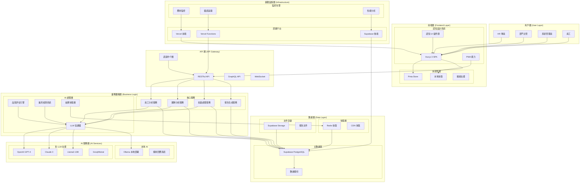

---

## 🎨 前端架構設計

### Vue.js 3 應用架構

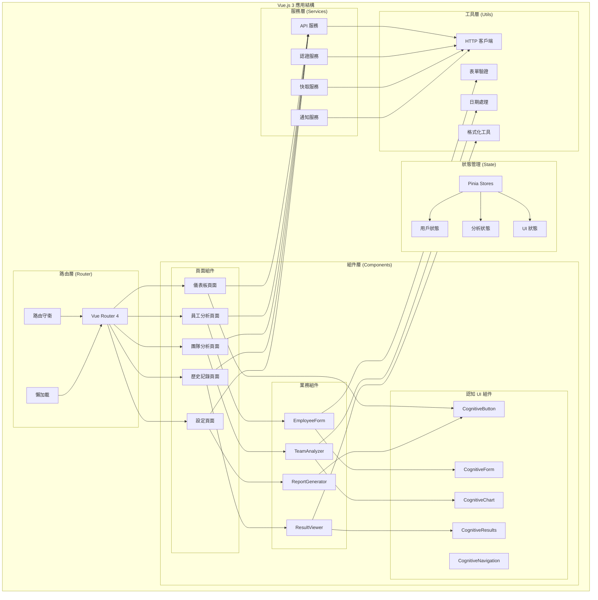

### 認知設計系統架構

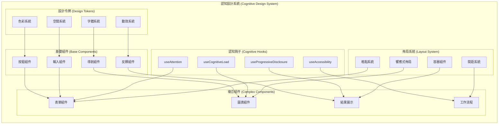

---

## 🔧 後端架構設計

### Serverless 微服務架構

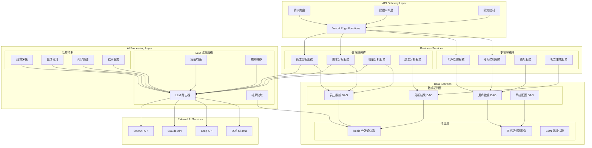

### 數據模型設計

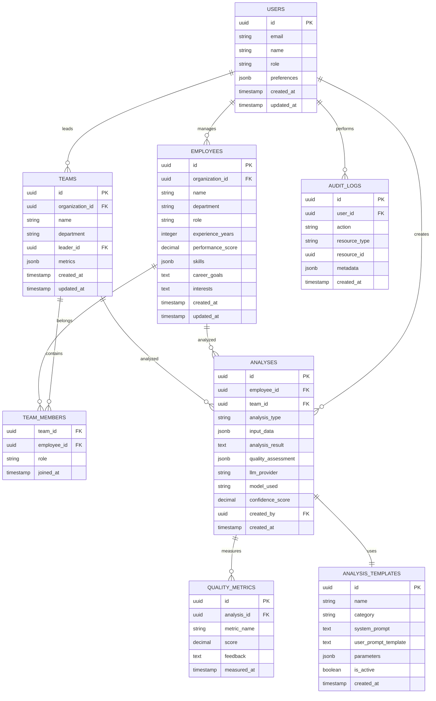

---

## 🤖 AI 服務架構

### LLM 協調系統

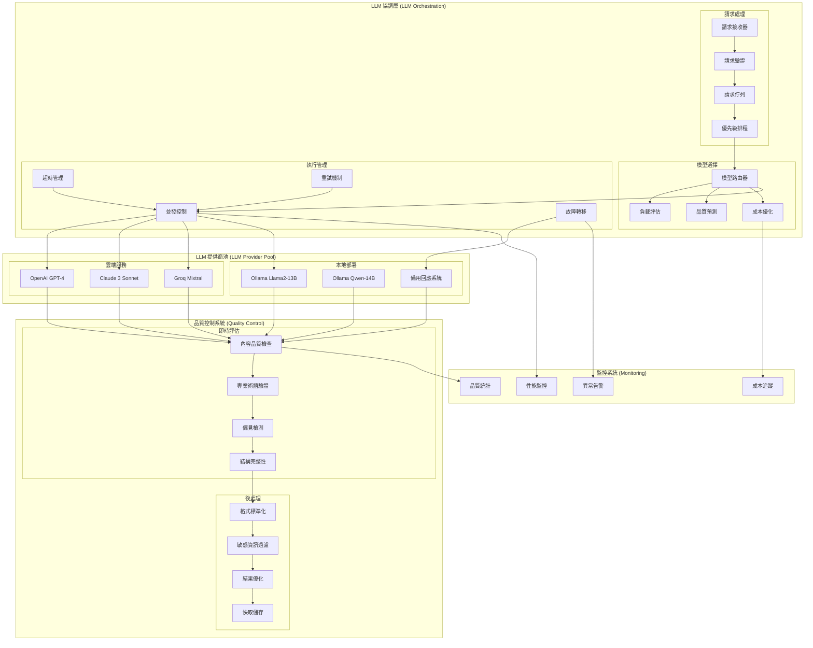

### AI 品質評估流程

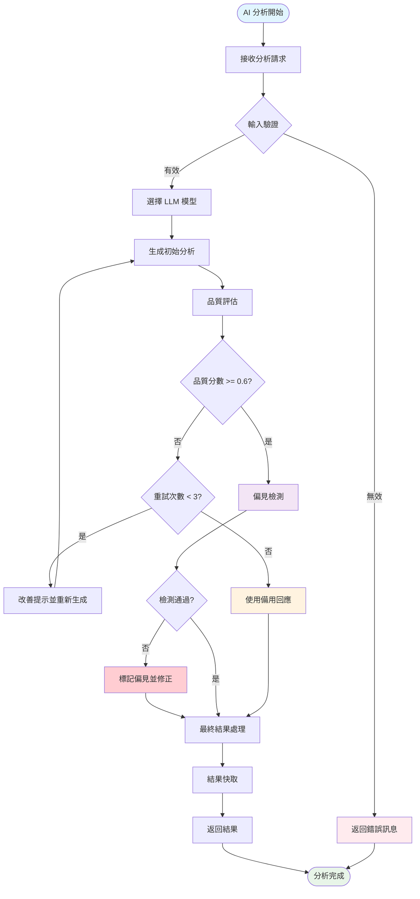

---

## 📊 數據流架構

### 員工分析數據流

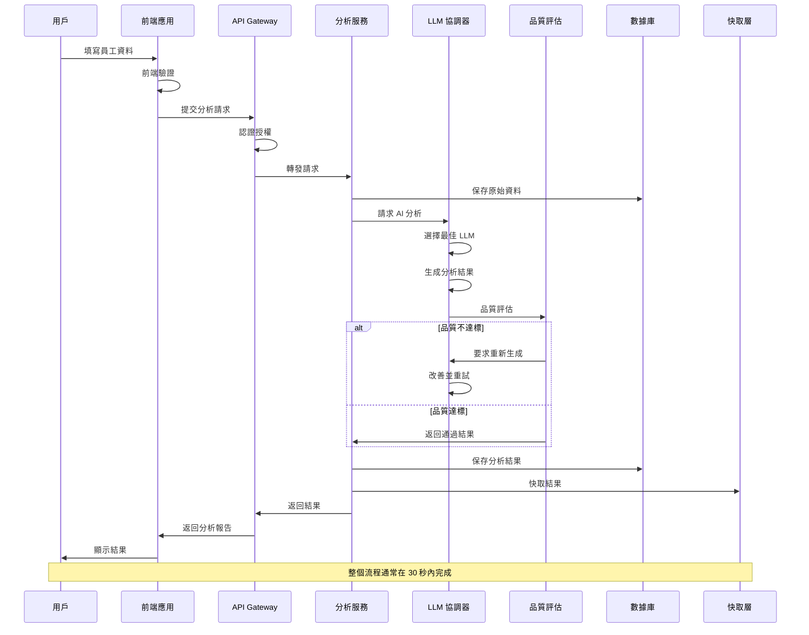

### 批量分析數據流

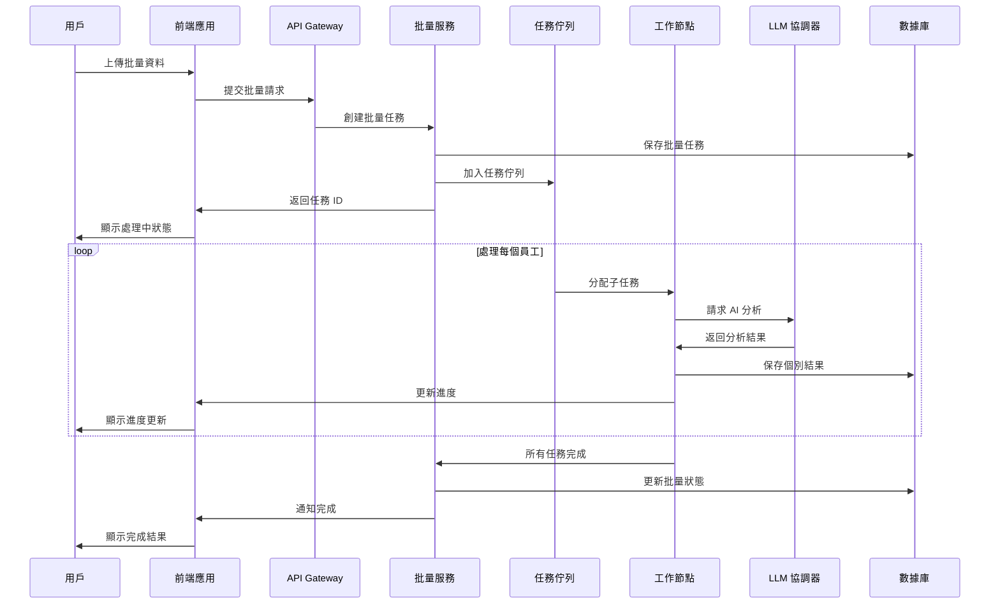

---

## 🔒 安全架構設計

### 安全層級架構

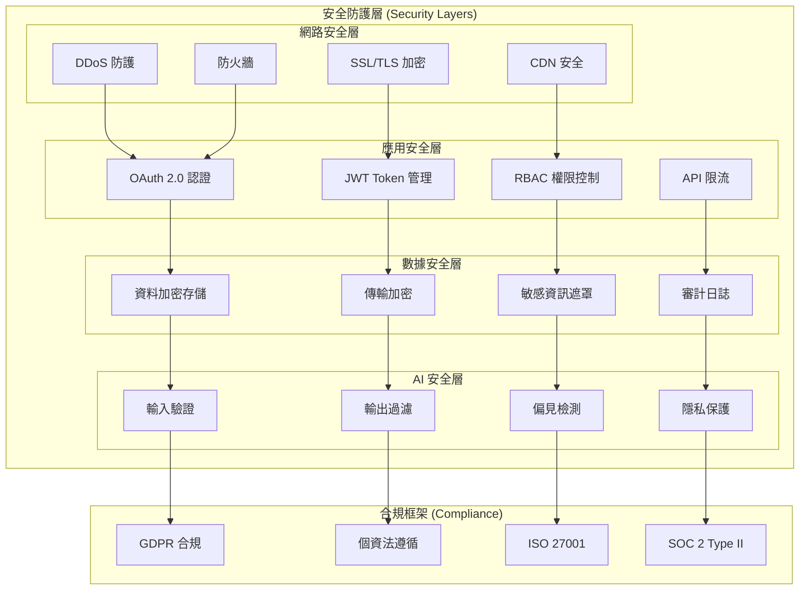

### 權限控制矩陣

| 角色 | 員工分析 | 團隊分析 | 批量分析 | 歷史查看 | 系統設定 | 用戶管理 |
|------|----------|----------|----------|----------|----------|----------|
| **系統管理員** | ✅ | ✅ | ✅ | ✅ | ✅ | ✅ |
| **HR 主管** | ✅ | ✅ | ✅ | ✅ | 🔒 | 🔒 |
| **HR 專員** | ✅ | 🔒 | 🔒 | ✅ | 🔒 | 🔒 |
| **部門主管** | ✅ (本部門) | ✅ (本部門) | 🔒 | ✅ (本部門) | 🔒 | 🔒 |
| **員工** | ✅ (本人) | 🔒 | 🔒 | ✅ (本人) | 🔒 | 🔒 |

---

## 🚀 部署架構設計

### 漸進式部署策略

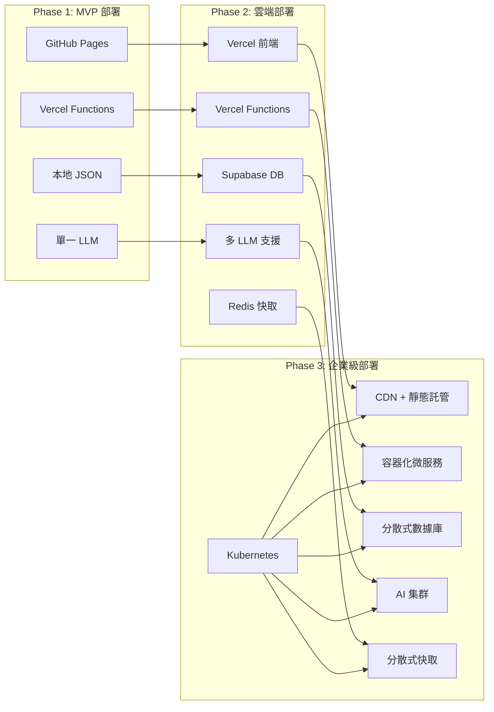

### 容器化架構 (Phase 3)

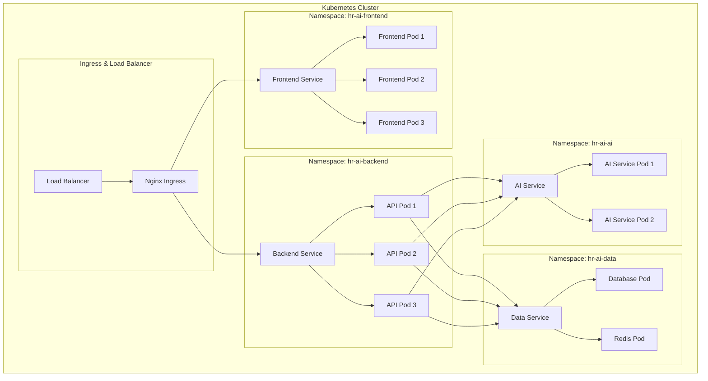

---

## 📈 性能架構設計

### 性能優化策略

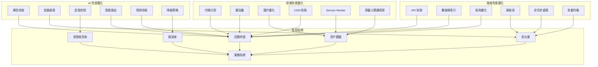

### 性能目標

| 指標類型 | 目標值 | 監控頻率 | 告警閾值 |
|----------|--------|----------|----------|
| **頁面載入時間** | < 2 秒 | 即時 | > 3 秒 |
| **API 回應時間** | < 500ms | 即時 | > 1 秒 |
| **AI 分析時間** | < 30 秒 | 即時 | > 45 秒 |
| **系統可用性** | > 99.9% | 5 分鐘 | < 99% |
| **並發用戶數** | 1000+ | 5 分鐘 | 超載警告 |
| **錯誤率** | < 0.1% | 即時 | > 1% |

---

## 🔄 災難恢復和備份

### 備份策略

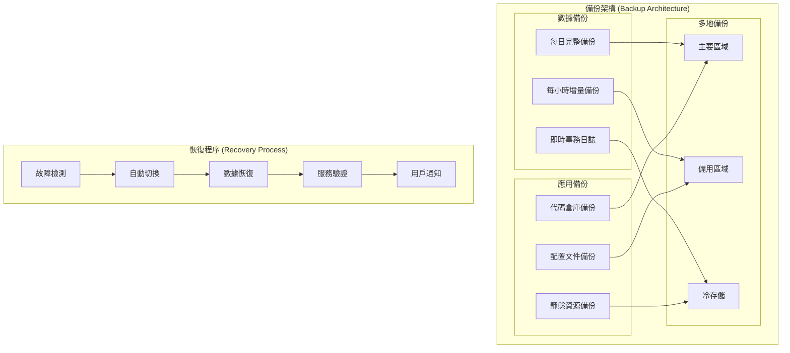

### RTO/RPO 目標

| 服務等級 | RTO (恢復時間) | RPO (數據丟失) | 可用性 |
|----------|----------------|----------------|--------|
| **關鍵服務** | < 1 小時 | < 15 分鐘 | 99.95% |
| **重要服務** | < 4 小時 | < 1 小時 | 99.9% |
| **一般服務** | < 24 小時 | < 4 小時 | 99.5% |

---

## 📋 架構檢查清單

### 設計驗證

#### ✅ 架構原則檢查
- [ ] 模組化設計，職責清晰
- [ ] 低耦合高內聚
- [ ] 可擴展性設計
- [ ] 故障隔離機制
- [ ] 性能優化策略
- [ ] 安全防護多層次

#### ✅ 技術選型驗證
- [ ] 技術棧成熟穩定
- [ ] 團隊技術能力匹配
- [ ] 維護成本可控
- [ ] 擴展性滿足需求
- [ ] 社群支援充足
- [ ] 長期發展前景良好

#### ✅ 非功能需求
- [ ] 性能指標明確
- [ ] 安全要求滿足
- [ ] 可維護性良好
- [ ] 可測試性充分
- [ ] 監控覆蓋完整
- [ ] 文檔完整清晰

---

此架構設計文檔為 HR AI 平台提供了完整的技術架構藍圖，確保系統的可擴展性、可維護性和高可用性。