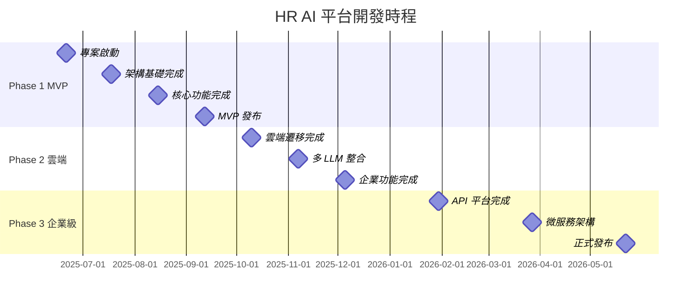

# 🗓️ 開發里程碑和交付計劃
## HR AI 人才生態系統平台

### 📝 文檔資訊
- **版本**: v1.0
- **建立日期**: 2025-06-21
- **最後更新**: 2025-06-21
- **負責人**: 專案管理團隊
- **狀態**: 執行中

---

## 🎯 項目概覽

### 項目目標
建立一個完整的 HR AI 人才分析平台，從 MVP 到企業級解決方案的漸進式發展路徑。

### 總體時程
- **項目期間**: 12 個月
- **主要階段**: 3 個階段
- **交付模式**: 敏捷開發，2週一個 Sprint
- **發布策略**: 持續集成持續部署 (CI/CD)

### 成功指標
- **技術指標**: 系統穩定性 99.9%、回應時間 < 2秒
- **業務指標**: 用戶滿意度 > 4.5/5、月活躍用戶 1000+
- **品質指標**: 代碼覆蓋率 > 80%、AI 分析準確度 > 85%

---

## 📅 詳細時程規劃

### Phase 1: MVP 開發階段 (2-3 個月)

#### 🎯 階段目標
- 建立基礎功能和技術架構
- 驗證核心概念和用戶需求
- 建立開發流程和品質標準

#### 📋 主要交付物

**Month 1: 基礎架構建立**

**Sprint 1-2 (Week 1-4): 項目啟動與基礎設施**
```
Week 1-2: 項目初始化
├── 📋 專案規劃文檔完成 (PRD, TDD, BDD, 架構設計)
├── 🛠️ 開發環境建立
│   ├── Git 倉庫設置
│   ├── CI/CD 管道建立
│   ├── 代碼品質工具配置
│   └── 測試框架設置
├── 🎨 認知設計系統基礎
│   ├── 設計令牌定義
│   ├── 色彩系統實現
│   ├── 基礎組件開發
│   └── 響應式佈局框架
└── 📱 前端專案架構搭建
    ├── Vue.js 3 + Vite 設置
    ├── 路由結構規劃
    ├── 狀態管理 (Pinia) 配置
    └── API 客戶端設置

Week 3-4: 後端基礎建立
├── 🔧 Serverless Functions 建立
│   ├── Vercel Functions 設置
│   ├── API 路由規劃
│   ├── 請求驗證中介層
│   └── 錯誤處理機制
├── 🤖 LLM 整合基礎
│   ├── LLM 客戶端架構
│   ├── OpenAI API 整合
│   ├── 備用回應系統
│   └── 品質評估框架
└── 📊 數據管理基礎
    ├── 數據模型設計
    ├── 本地存儲機制
    └── 數據驗證規則
```

**Sprint 3-4 (Week 5-8): 核心功能開發**
```
Week 5-6: 員工分析核心功能
├── 👤 員工分析表單
│   ├── 基本資料輸入組件
│   ├── 技能評估動態表單
│   ├── 表單驗證機制
│   └── 用戶體驗優化
├── 🤖 AI 分析引擎
│   ├── 提示模板系統
│   ├── LLM 請求處理
│   ├── 回應品質評估
│   └── 結果標準化處理
└── 📊 結果展示系統
    ├── 分析結果組件
    ├── 漸進披露機制
    ├── 視覺化圖表基礎
    └── 報告下載功能

Week 7-8: 用戶體驗完善
├── 🎨 認知 UI 組件完善
│   ├── CognitiveButton 組件
│   ├── CognitiveForm 組件
│   ├── CognitiveResults 組件
│   └── 載入狀態管理
├── 📱 響應式設計實現
│   ├── 桌面版優化
│   ├── 平板適配
│   ├── 手機版基礎支援
│   └── 觸控操作優化
└── ♿ 無障礙功能
    ├── 鍵盤導航支援
    ├── 螢幕閱讀器相容
    ├── 高對比度模式
    └── 字體大小調整
```

**Month 2: 功能完善與測試**

**Sprint 5-6 (Week 9-12): 功能完善與品質提升**
```
Week 9-10: 進階功能開發
├── 🔍 搜尋和篩選功能
│   ├── 歷史記錄搜尋
│   ├── 分析結果篩選
│   ├── 標籤分類系統
│   └── 快速搜尋優化
├── 📈 數據視覺化
│   ├── Chart.js 整合
│   ├── 能力雷達圖
│   ├── 趨勢分析圖表
│   └── 互動式圖表
└── 🛡️ 偏見檢測系統
    ├── 偏見檢測算法
    ├── 警告提示機制
    ├── 修正建議生成
    └── 合規性檢查

Week 11-12: 測試與優化
├── 🧪 測試套件完善
│   ├── 單元測試覆蓋率 > 80%
│   ├── 整合測試實現
│   ├── E2E 測試關鍵流程
│   └── 性能測試基準
├── 🔧 性能優化
│   ├── 代碼分割優化
│   ├── 圖片懶加載
│   ├── API 請求優化
│   └── 快取策略實現
└── 🐛 Bug 修復與穩定性
    ├── 錯誤處理完善
    ├── 邊界條件測試
    ├── 用戶反饋問題修復
    └── 系統穩定性驗證
```

**Month 3: 部署與發布**

**Sprint 7 (Week 13-14): MVP 發布準備**
```
Week 13-14: 發布準備
├── 🚀 部署準備
│   ├── GitHub Pages 部署配置
│   ├── 環境變數管理
│   ├── 域名與 SSL 設置
│   └── 監控系統建立
├── 📚 文檔完善
│   ├── 用戶使用手冊
│   ├── API 文檔
│   ├── 部署文檔
│   └── 維護指南
├── 🎯 用戶接受測試
│   ├── Alpha 測試 (內部)
│   ├── Beta 測試 (外部用戶)
│   ├── 反饋收集與分析
│   └── 關鍵問題修復
└── ✅ 發布檢查清單
    ├── 功能完整性檢查
    ├── 性能指標驗證
    ├── 安全漏洞掃描
    └── 備份恢復測試
```

#### 📊 Phase 1 交付物清單

| 交付物類別 | 具體項目 | 完成標準 |
|------------|----------|----------|
| **核心功能** | 員工個人分析 | 支援完整分析流程，AI 回應時間 < 30秒 |
| **技術架構** | 前端 Vue.js 應用 | 響應式設計，載入時間 < 2秒 |
| **AI 整合** | OpenAI GPT-4 整合 | 品質評估分數 > 0.6，備用機制正常 |
| **用戶體驗** | 認知友善介面 | 通過認知負荷測試，無障礙功能完整 |
| **品質保證** | 測試覆蓋率 > 80% | 單元測試、整合測試、E2E 測試 |
| **部署** | GitHub Pages 上線 | 可公開訪問，基本監控就緒 |

---

### Phase 2: 雲端升級階段 (3-6 個月)

#### 🎯 階段目標
- 升級到雲端架構，提升可擴展性
- 增加進階功能，滿足企業需求
- 建立多租戶支援和用戶管理

#### 📋 主要交付物

**Month 4: 雲端基礎設施升級**

**Sprint 8-9 (Week 15-18): 雲端遷移**
```
Week 15-16: 後端雲端化
├── 🏗️ Supabase 整合
│   ├── PostgreSQL 數據庫設置
│   ├── 數據模型遷移
│   ├── 數據備份策略
│   └── 性能監控設置
├── ⚡ Vercel 部署升級
│   ├── Vercel Functions 優化
│   ├── 邊緣計算設置
│   ├── 自動擴展配置
│   └── 監控告警系統
└── 🔒 安全架構升級
    ├── Supabase Auth 整合
    ├── JWT Token 管理
    ├── API 安全強化
    └── 數據加密實現

Week 17-18: 多 LLM 支援
├── 🤖 LLM 協調系統
│   ├── Claude 3 API 整合
│   ├── Groq API 整合
│   ├── Ollama 本地支援
│   └── 智能路由機制
├── 📊 品質控制升級
│   ├── 多模型對比評估
│   ├── 動態品質閾值
│   ├── 自動降級機制
│   └── 成本優化算法
└── ⚖️ 負載均衡
    ├── LLM 請求分發
    ├── 故障轉移機制
    ├── 並發控制
    └── 資源使用監控
```

**Sprint 10-11 (Week 19-22): 進階功能開發**
```
Week 19-20: 團隊分析功能
├── 👥 團隊分析模組
│   ├── 團隊資料管理
│   ├── 成員關係建模
│   ├── 協作模式分析
│   └── 團隊動態評估
├── 📈 團隊視覺化
│   ├── 團隊技能分布圖
│   ├── 協作網絡圖
│   ├── 績效趨勢分析
│   └── 風險評估儀表板
└── 🎯 團隊建議系統
    ├── 團隊優化建議
    ├── 人員配置建議
    ├── 培訓需求分析
    └── 發展路徑規劃

Week 21-22: 批量處理功能
├── 📁 批量上傳系統
│   ├── CSV/Excel 檔案解析
│   ├── 資料格式驗證
│   ├── 錯誤處理機制
│   └── 進度追蹤顯示
├── ⚡ 並行處理引擎
│   ├── 任務佇列管理
│   ├── 工作節點調度
│   ├── 失敗重試機制
│   └── 資源使用優化
└── 📊 批量報告生成
    ├── 個別分析報告
    ├── 匯總統計報告
    ├── 比較分析圖表
    └── 匯出格式支援
```

**Month 5: 用戶管理與權限**

**Sprint 12-13 (Week 23-26): 多租戶架構**
```
Week 23-24: 用戶管理系統
├── 👤 用戶認證升級
│   ├── 多種登入方式
│   ├── SSO 整合準備
│   ├── 密碼安全策略
│   └── 會話管理優化
├── 🏢 組織管理
│   ├── 多組織支援
│   ├── 組織階層管理
│   ├── 部門結構設置
│   └── 用戶歸屬管理
└── 🔐 權限控制系統
    ├── RBAC 角色管理
    ├── 細粒度權限控制
    ├── 資料訪問控制
    └── 操作日誌記錄

Week 25-26: 系統設定與客製化
├── ⚙️ 系統設定介面
│   ├── LLM 模型設定
│   ├── 品質閾值調整
│   ├── 通知偏好設定
│   └── 介面個人化
├── 🎨 主題與樣式
│   ├── 多主題支援
│   ├── 企業品牌客製化
│   ├── 色彩偏好設定
│   └── 字體大小調整
└── 📊 分析模板管理
    ├── 自定義分析模板
    ├── 提示詞編輯器
    ├── 模板分享機制
    └── 版本控制系統
```

**Month 6: 進階分析與報告**

**Sprint 14-15 (Week 27-30): 智能分析功能**
```
Week 27-28: 進階分析功能
├── 🔮 預測性分析
│   ├── 離職風險預測
│   ├── 績效趨勢預測
│   ├── 職業發展預測
│   └── 培訓需求預測
├── 📊 對比分析
│   ├── 同儕比較分析
│   ├── 歷史對比分析
│   ├── 行業基準對比
│   └── 團隊間比較
└── 🎯 智能推薦
    ├── 職位匹配推薦
    ├── 培訓課程推薦
    ├── 導師配對推薦
    └── 職業路徑推薦

Week 29-30: 報告系統升級
├── 📄 專業報告生成
│   ├── PDF 報告模板
│   ├── PowerPoint 簡報
│   ├── Excel 數據分析
│   └── 自定義報告格式
├── 🔔 智能通知系統
│   ├── 分析完成通知
│   ├── 重要洞察提醒
│   ├── 定期報告推送
│   └── 異常狀況警報
└── 📈 儀表板系統
    ├── 個人化儀表板
    ├── 管理層儀表板
    ├── 即時數據更新
    └── 互動式數據探索
```

#### 📊 Phase 2 交付物清單

| 交付物類別 | 具體項目 | 完成標準 |
|------------|----------|----------|
| **雲端架構** | Vercel + Supabase 部署 | 支援 1000+ 並發用戶，99.9% 可用性 |
| **多 LLM 支援** | 4+ LLM 提供商整合 | 智能路由，故障轉移時間 < 30秒 |
| **團隊分析** | 完整團隊分析功能 | 支援 50+ 成員團隊分析 |
| **批量處理** | 50+ 員工批量分析 | 處理時間 < 5分鐘，成功率 > 95% |
| **用戶管理** | 多租戶權限系統 | RBAC 權限控制，審計日誌完整 |
| **報告系統** | 多格式報告生成 | PDF/PPT/Excel 匯出，模板客製化 |

---

### Phase 3: 企業級擴展階段 (6-12 個月)

#### 🎯 階段目標
- 建立企業級功能和安全性
- 實現大規模部署和高可用性
- 提供完整的 API 和整合能力

#### 📋 主要交付物

**Month 7-8: 企業級功能**

**Sprint 16-17 (Week 31-34): API 與整合**
```
Week 31-32: API 平台建立
├── 🔌 RESTful API 完善
│   ├── OpenAPI 規格完整
│   ├── API 版本控制
│   ├── 開發者文檔
│   └── SDK 開發套件
├── 📡 GraphQL API
│   ├── Schema 設計
│   ├── 查詢優化
│   ├── 即時訂閱
│   └── 效能監控
└── 🔗 第三方整合
    ├── HRIS 系統整合
    ├── 學習管理系統
    ├── 績效管理系統
    └── 招聘管理系統

Week 33-34: 工作流程自動化
├── 🤖 自動化工作流
│   ├── 定期分析排程
│   ├── 觸發條件設定
│   ├── 動作執行引擎
│   └── 結果通知機制
├── 📋 審批流程
│   ├── 多層級審批
│   ├── 條件式路由
│   ├── 時限管理
│   └── 歷史追蹤
└── 🔄 數據同步
    ├── 即時數據同步
    ├── 衝突解決機制
    ├── 增量同步優化
    └── 錯誤恢復機制
```

**Sprint 18-19 (Week 35-38): 安全與合規**
```
Week 35-36: 安全架構強化
├── 🛡️ 高級安全功能
│   ├── 多因子認證 (MFA)
│   ├── 單一登入 (SSO)
│   ├── API 金鑰管理
│   └── IP 白名單控制
├── 🔒 數據保護升級
│   ├── 端到端加密
│   ├── 欄位級加密
│   ├── 敏感資料遮罩
│   └── 數據保留策略
└── 📋 合規性管理
    ├── GDPR 合規工具
    ├── 個資法遵循
    ├── 資料處理記錄
    └── 用戶同意管理

Week 37-38: 審計與監控
├── 📊 全面監控系統
│   ├── 應用性能監控
│   ├── 基礎設施監控
│   ├── 業務指標監控
│   └── 用戶行為分析
├── 🔍 安全監控
│   ├── 異常行為檢測
│   ├── 威脅情報整合
│   ├── 入侵檢測系統
│   └── 安全事件回應
└── 📝 審計系統
    ├── 完整操作日誌
    ├── 合規性報告
    ├── 數據血緣追蹤
    └── 審計報告生成
```

**Month 9-10: 高可用性架構**

**Sprint 20-21 (Week 39-42): 微服務架構**
```
Week 39-40: 服務拆分
├── 🏗️ 微服務設計
│   ├── 服務邊界定義
│   ├── API Gateway 設計
│   ├── 服務註冊發現
│   └── 配置管理中心
├── 📦 容器化部署
│   ├── Docker 容器化
│   ├── Kubernetes 部署
│   ├── Helm Charts 管理
│   └── 自動化部署管道
└── 🔄 服務治理
    ├── 服務網格 (Service Mesh)
    ├── 流量管理
    ├── 故障注入測試
    └── 混沌工程實踐

Week 41-42: 分散式系統
├── 💾 分散式數據庫
│   ├── 讀寫分離
│   ├── 數據分片策略
│   ├── 分散式事務
│   └── 數據一致性保證
├── ⚡ 分散式快取
│   ├── Redis 集群
│   ├── 快取一致性
│   ├── 快取穿透防護
│   └── 熱點數據處理
└── 🔔 訊息佇列
    ├── 非同步訊息處理
    ├── 事件驅動架構
    ├── 訊息可靠性保證
    └── 死信佇列處理
```

**Sprint 22-23 (Week 43-46): 效能與擴展**
```
Week 43-44: 性能優化
├── ⚡ 前端性能優化
│   ├── 程式碼分割優化
│   ├── 預載入策略
│   ├── Service Worker 快取
│   └── CDN 邊緣快取
├── 🚀 後端性能優化
│   ├── 資料庫查詢優化
│   ├── API 回應快取
│   ├── 連接池優化
│   └── 非同步處理優化
└── 🤖 AI 性能優化
    ├── 模型推理優化
    ├── 批量處理優化
    ├── 結果快取策略
    └── 負載均衡優化

Week 45-46: 自動擴展
├── 📈 水平擴展
│   ├── Pod 自動擴展
│   ├── 節點自動擴展
│   ├── 負載預測
│   └── 資源調度優化
├── 🔄 藍綠部署
│   ├── 零停機部署
│   ├── 自動回滾機制
│   ├── 健康檢查
│   └── 流量切換
└── 🧪 混沌工程
    ├── 故障注入測試
    ├── 系統韌性驗證
    ├── 恢復能力測試
    └── 災難恢復演練
```

**Month 11-12: 最終化與發布**

**Sprint 24-25 (Week 47-50): 最終整合**
```
Week 47-48: 系統整合測試
├── 🧪 端到端測試
│   ├── 完整業務流程測試
│   ├── 整合測試自動化
│   ├── 性能壓力測試
│   └── 安全滲透測試
├── 📊 性能基準測試
│   ├── 負載測試
│   ├── 併發測試
│   ├── 穩定性測試
│   └── 容量規劃
└── 🔒 安全評估
    ├── 漏洞掃描
    ├── 程式碼安全審查
    ├── 合規性檢查
    └── 第三方安全評估

Week 49-50: 發布準備
├── 📚 文檔完善
│   ├── 管理員手冊
│   ├── API 開發者指南
│   ├── 部署運維手冊
│   └── 故障排除指南
├── 🎓 培訓準備
│   ├── 用戶培訓教材
│   ├── 管理員培訓
│   ├── 開發者培訓
│   └── 線上培訓課程
└── 🚀 正式發布
    ├── 發布計劃執行
    ├── 監控系統啟動
    ├── 用戶支援準備
    └── 市場推廣啟動
```

**Sprint 26 (Week 51-52): 項目收尾**
```
Week 51-52: 項目總結
├── 📋 項目回顧
│   ├── 目標達成評估
│   ├── 經驗教訓總結
│   ├── 最佳實踐整理
│   └── 改進建議提出
├── 🔄 知識轉移
│   ├── 技術知識轉移
│   ├── 運維知識轉移
│   ├── 業務知識轉移
│   └── 維護團隊建立
└── 🎯 後續規劃
    ├── 維護計劃制定
    ├── 功能升級規劃
    ├── 技術演進路線
    └── 商業化策略
```

#### 📊 Phase 3 交付物清單

| 交付物類別 | 具體項目 | 完成標準 |
|------------|----------|----------|
| **API 平台** | 完整 API 生態系統 | RESTful + GraphQL，SDK 支援 |
| **企業安全** | 企業級安全架構 | MFA, SSO, 端到端加密 |
| **微服務架構** | Kubernetes 部署 | 支援 10K+ 並發，自動擴展 |
| **高可用性** | 99.99% 可用性 | 多區域部署，災難恢復 |
| **監控系統** | 全面監控告警 | APM, 安全監控, 業務指標 |
| **合規性** | GDPR/個資法合規 | 完整審計追蹤，合規報告 |

---

## 🎯 關鍵里程碑

### 主要檢查點



### 里程碑驗收標準

#### M1: 專案啟動 (Week 1)
- [ ] 所有專案文檔完成並審查通過
- [ ] 開發環境建立完成
- [ ] 團隊角色分工明確
- [ ] 第一個 Sprint 計劃確認

#### M2: 架構基礎完成 (Week 7)
- [ ] 前端基礎架構搭建完成
- [ ] 後端 API 框架建立
- [ ] LLM 整合基礎完成
- [ ] 認知設計系統建立

#### M3: 核心功能完成 (Week 11)
- [ ] 員工分析功能端到端完成
- [ ] AI 分析品質達標 (>0.6)
- [ ] 用戶體驗測試通過
- [ ] 基礎測試覆蓋率達標

#### M4: MVP 發布 (Week 14)
- [ ] 系統部署到 GitHub Pages
- [ ] 基本監控系統運行
- [ ] 用戶接受測試通過
- [ ] 文檔和支援就緒

#### M5: 雲端遷移完成 (Week 21)
- [ ] Supabase 數據庫正常運行
- [ ] Vercel 部署架構完成
- [ ] 數據遷移無損失
- [ ] 性能指標達標

#### M6: 多 LLM 整合 (Week 25)
- [ ] 4+ LLM 提供商整合完成
- [ ] 智能路由機制運行
- [ ] 故障轉移測試通過
- [ ] 成本優化機制生效

#### M7: 企業功能完成 (Week 33)
- [ ] 團隊分析功能完整
- [ ] 批量處理功能穩定
- [ ] 用戶權限系統完善
- [ ] 報告生成系統完成

#### M8: API 平台完成 (Week 41)
- [ ] RESTful 和 GraphQL API 完成
- [ ] 第三方整合測試通過
- [ ] API 文檔和 SDK 就緒
- [ ] 開發者支援建立

#### M9: 微服務架構 (Week 49)
- [ ] Kubernetes 部署成功
- [ ] 服務治理機制完善
- [ ] 自動擴展測試通過
- [ ] 災難恢復演練成功

#### M10: 正式發布 (Week 52)
- [ ] 所有功能測試通過
- [ ] 性能和安全評估合格
- [ ] 用戶培訓完成
- [ ] 正式商業化啟動

---

## 📊 資源規劃

### 團隊配置

#### 核心團隊 (全程參與)
- **專案經理** (1人): 整體項目協調和進度管控
- **前端開發** (2人): Vue.js 開發和 UI 實現
- **後端開發** (2人): API 開發和系統架構
- **AI 工程師** (1人): LLM 整合和 AI 相關功能
- **QA 測試** (1人): 測試自動化和品質保證
- **DevOps** (1人): 部署運維和基礎設施

#### 階段性專家 (特定階段參與)
- **UX 設計師** (Phase 1): 認知設計系統和用戶體驗
- **安全專家** (Phase 3): 企業級安全和合規
- **架構師** (Phase 3): 微服務架構和高可用設計
- **產品經理** (全程): 需求管理和商業決策

### 技術資源

#### 開發工具
- **版本控制**: Git + GitHub
- **IDE**: VS Code + Vue/Python 擴展
- **設計工具**: Figma (UI 設計)
- **專案管理**: GitHub Projects + Notion

#### 雲端服務
- **Phase 1**: GitHub Pages (免費)
- **Phase 2**: Vercel Pro + Supabase Pro ($100/月)
- **Phase 3**: 企業級雲端服務 ($500-1000/月)

#### 第三方服務
- **LLM API**: OpenAI, Claude, Groq (使用量計費)
- **監控服務**: Vercel Analytics, Sentry
- **安全服務**: Snyk, OWASP 掃描工具

---

## 🔄 風險管理

### 技術風險

#### 高風險項目
| 風險項目 | 影響度 | 機率 | 緩解策略 | 應急方案 |
|----------|--------|------|----------|----------|
| **LLM API 限制** | 高 | 中 | 多提供商備用 | 本地模型部署 |
| **性能瓶頸** | 中 | 中 | 早期性能測試 | 架構重構 |
| **安全漏洞** | 高 | 低 | 定期安全審查 | 緊急修補流程 |

#### 中風險項目  
| 風險項目 | 影響度 | 機率 | 緩解策略 | 應急方案 |
|----------|--------|------|----------|----------|
| **第三方整合問題** | 中 | 中 | 提前技術驗證 | 功能降級 |
| **團隊人員變動** | 中 | 中 | 知識文檔化 | 外部支援 |
| **技術債務累積** | 中 | 高 | 定期重構 | 技術升級 |

### 商業風險

#### 市場風險
- **競爭對手**: 持續監控市場，強化差異化優勢
- **需求變化**: 敏捷開發，快速迭代適應
- **法規變化**: 主動合規，建立法務諮詢

#### 資源風險  
- **預算超支**: 階段性預算控制，成本監控
- **時程延誤**: 缓衝時間規劃，關鍵路徑管理
- **品質問題**: 測試驅動開發，持續品質監控

---

## 📈 成功指標追蹤

### 技術指標

#### 系統性能
- **回應時間**: < 2秒 (頁面載入), < 30秒 (AI 分析)
- **可用性**: 99.9% (Phase 2), 99.99% (Phase 3)
- **併發用戶**: 100+ (Phase 1), 1000+ (Phase 2), 10000+ (Phase 3)
- **錯誤率**: < 0.1%

#### 代碼品質
- **測試覆蓋率**: > 80%
- **代碼重複率**: < 5%
- **技術債務指數**: < 30 分鐘 (SonarQube)
- **安全漏洞**: 0 個高風險漏洞

### 業務指標

#### 用戶採用
- **註冊用戶**: 100+ (Phase 1), 1000+ (Phase 2), 5000+ (Phase 3)
- **活躍用戶**: DAU/MAU > 30%
- **用戶留存**: 7天 > 60%, 30天 > 40%
- **用戶滿意度**: NPS > 50

#### 產品價值
- **分析完成率**: > 95%
- **AI 分析準確度**: > 85%
- **用戶工作效率提升**: > 50%
- **功能使用率**: 核心功能 > 80%

### 監控機制

#### 即時監控
- **系統性能**: Vercel Analytics, New Relic
- **錯誤追蹤**: Sentry, LogRocket  
- **用戶行為**: Google Analytics, Mixpanel
- **業務指標**: 自定義儀表板

#### 定期評估
- **週報**: 開發進度和技術指標
- **月報**: 業務指標和用戶反饋
- **季報**: 整體項目健康度評估
- **年報**: 戰略目標達成情況

---

## 🎯 結論與下一步

### 項目成功因素

#### 關鍵成功要素
1. **漸進式演進**: 從 MVP 到企業級的穩健發展路徑
2. **技術選型**: 成熟穩定的技術棧，降低技術風險
3. **品質優先**: TDD/BDD 驅動開發，確保交付品質
4. **用戶中心**: 認知友善設計，優化用戶體驗
5. **團隊協作**: 跨功能團隊，高效溝通協作

#### 預期成果
- **技術成果**: 穩定可擴展的 HR AI 分析平台
- **商業成果**: 可商業化的 SaaS 產品
- **團隊成果**: 成熟的產品開發和運維能力
- **市場成果**: 在 HR 科技領域建立競爭優勢

### 立即行動項目

#### 第一週行動清單
- [ ] 確認團隊成員和角色分工
- [ ] 建立開發環境和工具鏈
- [ ] 創建 Git 倉庫和 CI/CD 管道
- [ ] 啟動第一個 Sprint 規劃會議
- [ ] 開始認知設計系統開發

#### 第一個月目標
- [ ] 完成基礎架構搭建
- [ ] 實現第一個核心功能原型
- [ ] 建立測試和品質保證流程
- [ ] 確認用戶反饋收集機制

---

此開發路線圖為 HR AI 人才生態系統平台提供了詳細的實施計劃，確保項目按照既定目標順利推進，最終交付高品質的產品。