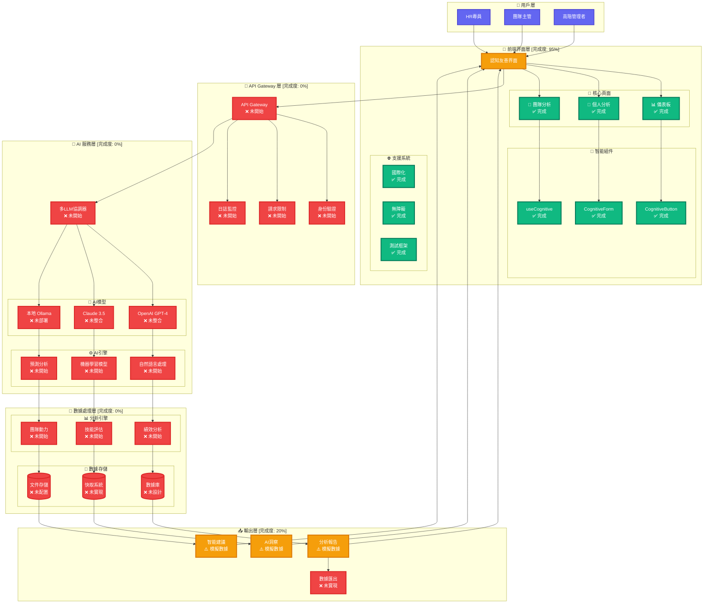
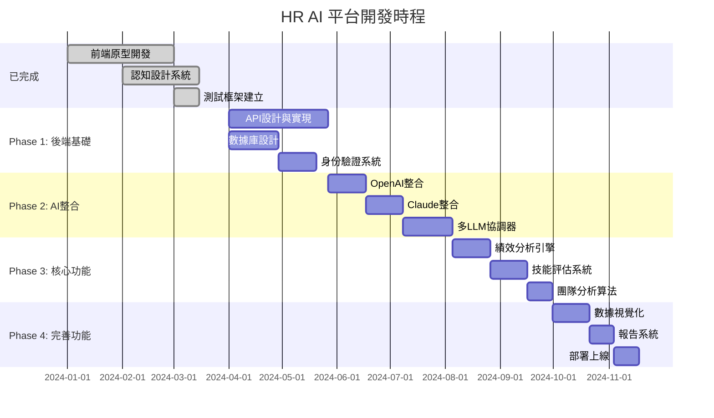

# 🏗️ HR AI 平台架構可視化分析

## 🎯 **完整系統架構圖**



## 📊 **功能矩陣分析**

### 🎯 **功能與完成度對照表**

| 功能模塊 | 子功能 | 完成度 | 狀態 | 預估工時 |
|---------|--------|--------|------|----------|
| **🎨 前端界面** | | **95%** | ✅ | 已完成 |
| └── 儀表板 | 數據展示、圖表框架 | 95% | ✅ | - |
| └── 個人分析 | 員工選擇、分析配置 | 95% | ✅ | - |
| └── 團隊分析 | 團隊選擇、協作展示 | 95% | ✅ | - |
| └── 認知組件 | 按鈕、表單、交互 | 100% | ✅ | - |
| **🔌 API 層** | | **0%** | ❌ | 8-10週 |
| └── RESTful API | 端點設計、文檔 | 0% | ❌ | 3週 |
| └── 身份驗證 | JWT、權限管理 | 0% | ❌ | 2週 |
| └── 數據驗證 | 輸入檢查、錯誤處理 | 0% | ❌ | 2週 |
| └── 監控日誌 | 請求追蹤、性能監控 | 0% | ❌ | 1週 |
| **🤖 AI 服務** | | **0%** | ❌ | 10-12週 |
| └── OpenAI整合 | GPT-4 API、優化 | 0% | ❌ | 3週 |
| └── Claude整合 | API連接、備援邏輯 | 0% | ❌ | 3週 |
| └── 本地模型 | Ollama部署、配置 | 0% | ❌ | 2週 |
| └── 協調器 | 多模型協調、決策 | 0% | ❌ | 4週 |
| **💾 數據引擎** | | **0%** | ❌ | 8-10週 |
| └── 績效分析 | 算法設計、實現 | 0% | ❌ | 3週 |
| └── 技能評估 | 評估模型、匹配 | 0% | ❌ | 3週 |
| └── 團隊動力 | 協作分析、網絡圖 | 0% | ❌ | 2週 |
| └── 預測模型 | ML訓練、預測 | 0% | ❌ | 2週 |
| **📊 數據視覺化** | | **5%** | ❌ | 4-6週 |
| └── Chart.js | 真實圖表渲染 | 0% | ❌ | 2週 |
| └── D3.js | 網絡圖、互動圖表 | 0% | ❌ | 3週 |
| └── 實時更新 | WebSocket、即時數據 | 0% | ❌ | 1週 |

## 🎯 **關鍵路徑分析**

### 🛣️ **從原型到產品的關鍵步驟**



## 🎯 **具體產出能力分析**

### ✅ **現在可以產出**

#### 🎨 **原型演示**
```
可展示功能:
├── 📱 完整用戶界面流程
├── 🧠 認知友善設計驗證
├── 📊 模擬數據互動演示
├── 🌐 多語言界面切換
└── ♿ 無障礙功能展示
```

#### 📋 **技術文檔**
```
可交付文檔:
├── 🏗️ 系統架構設計
├── 🎨 UI/UX 設計規範
├── 🧪 測試驅動開發流程
├── 🌍 國際化實施指南
└── ♿ 無障礙功能規範
```

### 🔄 **6個月後可以產出**

#### 🤖 **真實AI功能**
```
AI分析能力:
├── 👤 個人績效深度分析
├── 🎯 技能匹配與推薦
├── 👥 團隊協作模式識別
├── 📈 績效預測與建議
├── 🔍 人才缺口分析
└── 💡 智能HR策略建議
```

#### 📊 **商業價值產出**
```
業務成果:
├── 💰 招聘效率提升 30-50%
├── 📈 員工保留率提升 20-40%
├── 🎯 技能培訓精準度提升 60%
├── ⏰ HR決策時間縮短 70%
└── 💡 戰略洞察準確度 80%+
```

## 🚀 **成為真正AI Agent的路徑**

### 📍 **當前位置**: 高品質原型 (30%)
- ✅ 用戶界面完善
- ✅ 技術架構清晰
- ✅ 設計原則驗證
- ❌ 缺乏實際AI功能

### 🎯 **目標位置**: 智能AI Agent (100%)
- 🤖 真實AI分析能力
- 📊 實時數據處理
- 💡 智能決策支援
- 🔄 持續學習優化

### 🛣️ **路徑距離**: 70%的核心功能待開發
- **時間**: 4-6個月密集開發
- **成本**: $150K-200K 技術投資
- **團隊**: 2-3名專業工程師
- **風險**: 中等(技術成熟，主要是整合工程)

## 💎 **項目核心價值**

### 🏆 **已創造的價值**
1. **設計創新** - 首創認知友善HR界面
2. **技術基礎** - 現代化Vue.js架構
3. **用戶體驗** - 解決HR工具可用性痛點
4. **擴展性** - 為AI功能預留完整接口

### 🎯 **潛在商業價值**
1. **市場定位** - 差異化競爭優勢
2. **技術壁壘** - 認知科學+AI的獨特組合
3. **擴展性** - 可拓展到其他行業
4. **投資吸引力** - 完整原型+清晰路線圖

這個專案目前處於 **"精美原型"** 階段，具備了成為真正AI Agent的所有基礎條件，距離目標還有 **70%的工程實現工作**。