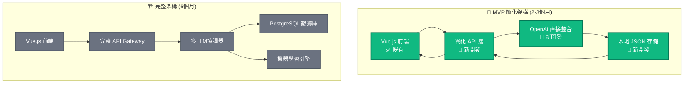
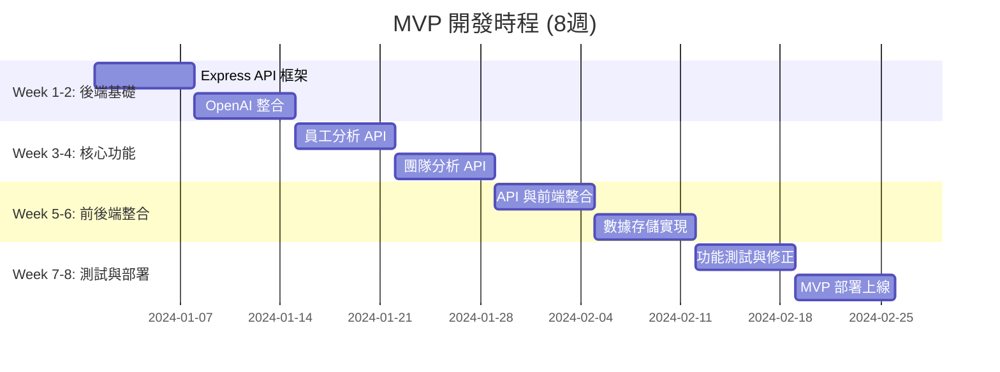

# 🚀 HR AI 平台 MVP 開發計劃

## 🎯 MVP 目標定義

將現有的前端原型升級為 **具備真實AI功能的最小可行產品**，在2-3個月內實現核心AI分析能力。

## 📋 MVP 功能範圍

### ✅ **保留既有優勢**
- 完整的認知友善前端界面
- Vue.js 3 技術架構
- 模擬數據作為備援方案

### 🎯 **新增核心AI功能**
- 真實員工數據輸入與分析
- OpenAI GPT-4 驅動的AI洞察
- 基礎數據持久化
- 簡化版報告生成

## 🏗️ **MVP 架構設計**

### 📊 **簡化架構 vs 完整架構**



## 🛠️ **MVP 技術棧選擇**

### 🎯 **最小技術棧 (快速實現)**
```
前端: Vue.js 3 (既有) ✅
後端: Node.js + Express (輕量)
AI: OpenAI API (直接調用)
存儲: 本地 JSON 文件 (簡單)
部署: Vercel (免費)
```

### 📈 **可擴展技術棧 (未來升級)**
```
前端: Vue.js 3 (不變)
後端: Node.js + Express → FastAPI
AI: OpenAI → 多LLM協調
存儲: JSON → PostgreSQL
部署: Vercel → AWS/GCP
```

## 📅 **MVP 開發時程規劃**

### 🗓️ **8週衝刺計劃**



## 💻 **具體實現方案**

### 🔧 **Step 1: 建立 Express 後端 (週1-2)**

#### 📁 **後端項目結構**
```
backend/
├── src/
│   ├── routes/
│   │   ├── employees.js     # 員工分析路由
│   │   ├── teams.js         # 團隊分析路由
│   │   └── ai.js           # AI 服務路由
│   ├── services/
│   │   ├── openaiService.js # OpenAI 整合
│   │   └── dataService.js   # 數據管理
│   ├── utils/
│   │   └── prompts.js       # AI 提示模板
│   └── app.js              # 主應用
├── data/                   # JSON 數據存儲
├── package.json
└── .env                    # 環境變數
```

#### 🎯 **核心文件實現**

**backend/src/app.js**
```javascript
const express = require('express');
const cors = require('cors');
const employeeRoutes = require('./routes/employees');
const teamRoutes = require('./routes/teams');

const app = express();

// 中間件
app.use(cors());
app.use(express.json());

// 路由
app.use('/api/employees', employeeRoutes);
app.use('/api/teams', teamRoutes);

// 健康檢查
app.get('/health', (req, res) => {
  res.json({ status: 'OK', timestamp: new Date().toISOString() });
});

const PORT = process.env.PORT || 3001;
app.listen(PORT, () => {
  console.log(`HR AI API Server running on port ${PORT}`);
});
```

### 🤖 **Step 2: OpenAI 服務整合 (週2)**

#### 🔑 **OpenAI 服務實現**

**backend/src/services/openaiService.js**
```javascript
const OpenAI = require('openai');

class OpenAIService {
  constructor() {
    this.client = new OpenAI({
      apiKey: process.env.OPENAI_API_KEY
    });
  }

  async analyzeEmployee(employeeData) {
    const prompt = this.buildEmployeePrompt(employeeData);
    
    try {
      const response = await this.client.chat.completions.create({
        model: "gpt-4",
        messages: [
          {
            role: "system",
            content: "你是專業的HR分析專家，擅長員工績效分析和發展建議。"
          },
          {
            role: "user", 
            content: prompt
          }
        ],
        max_tokens: 1000,
        temperature: 0.7
      });

      return this.parseEmployeeAnalysis(response.choices[0].message.content);
    } catch (error) {
      console.error('OpenAI API Error:', error);
      return this.getFallbackEmployeeAnalysis();
    }
  }

  async analyzeTeam(teamData) {
    const prompt = this.buildTeamPrompt(teamData);
    
    try {
      const response = await this.client.chat.completions.create({
        model: "gpt-4",
        messages: [
          {
            role: "system",
            content: "你是團隊動力分析專家，專門分析團隊協作模式和優化建議。"
          },
          {
            role: "user",
            content: prompt
          }
        ],
        max_tokens: 1200,
        temperature: 0.7
      });

      return this.parseTeamAnalysis(response.choices[0].message.content);
    } catch (error) {
      console.error('OpenAI API Error:', error);
      return this.getFallbackTeamAnalysis();
    }
  }

  buildEmployeePrompt(employee) {
    return `
請分析以下員工資料，提供專業的HR分析：

員工資訊：
- 姓名：${employee.name}
- 職位：${employee.position}
- 部門：${employee.department}
- 工作年資：${employee.experience}年
- 技能清單：${employee.skills.join(', ')}
- 近期績效：${employee.recentPerformance}
- 團隊回饋：${employee.feedback}

請提供：
1. 綜合評分 (1-10)
2. 核心優勢 (3-5點)
3. 改進建議 (3-5點)
4. 發展路徑建議
5. 風險評估

請以JSON格式回應：
{
  "overallScore": number,
  "strengths": [],
  "improvements": [],
  "developmentPlan": "string",
  "riskAssessment": "string"
}
    `;
  }

  buildTeamPrompt(team) {
    return `
請分析以下團隊資料，提供團隊動力分析：

團隊資訊：
- 團隊名稱：${team.name}
- 成員數量：${team.memberCount}
- 團隊組成：${team.members.map(m => `${m.name}(${m.role})`).join(', ')}
- 協作模式：${team.collaborationMode}
- 近期項目：${team.recentProjects}
- 團隊績效：${team.teamPerformance}

請提供：
1. 團隊評分 (1-10)
2. 協作效率評估
3. 團隊優勢
4. 潛在風險
5. 優化建議
6. 行動計劃

請以JSON格式回應：
{
  "teamScore": number,
  "collaborationEfficiency": number,
  "strengths": [],
  "risks": [],
  "suggestions": [],
  "actionPlan": []
}
    `;
  }

  parseEmployeeAnalysis(content) {
    try {
      // 嘗試解析JSON回應
      const analysis = JSON.parse(content);
      return {
        success: true,
        data: analysis,
        source: 'ai'
      };
    } catch (error) {
      // 如果不是JSON，進行文本解析
      return {
        success: true,
        data: this.parseTextToStructure(content, 'employee'),
        source: 'ai-parsed'
      };
    }
  }

  parseTeamAnalysis(content) {
    try {
      const analysis = JSON.parse(content);
      return {
        success: true,
        data: analysis,
        source: 'ai'
      };
    } catch (error) {
      return {
        success: true,
        data: this.parseTextToStructure(content, 'team'),
        source: 'ai-parsed'
      };
    }
  }

  getFallbackEmployeeAnalysis() {
    return {
      success: false,
      data: {
        overallScore: 7.5,
        strengths: ["具備基礎專業技能", "學習意願強", "團隊協作良好"],
        improvements: ["可加強領導力", "提升技術深度", "增強溝通技巧"],
        developmentPlan: "建議參與進階技能培訓，並承擔更多項目責任。",
        riskAssessment: "整體風險較低，建議持續關注職涯發展需求。"
      },
      source: 'fallback'
    };
  }

  getFallbackTeamAnalysis() {
    return {
      success: false,
      data: {
        teamScore: 8.0,
        collaborationEfficiency: 75,
        strengths: ["團隊氛圍良好", "技能互補性強", "溝通效率高"],
        risks: ["工作負荷分配不均", "缺乏備援人員"],
        suggestions: ["優化工作分配", "增加知識分享", "建立導師制度"],
        actionPlan: ["制定工作分配指南", "安排技能交流會", "設立月度檢討機制"]
      },
      source: 'fallback'
    };
  }
}

module.exports = OpenAIService;
```

### 📊 **Step 3: API 路由實現 (週3-4)**

#### 👤 **員工分析 API**

**backend/src/routes/employees.js**
```javascript
const express = require('express');
const OpenAIService = require('../services/openaiService');
const DataService = require('../services/dataService');

const router = express.Router();
const openaiService = new OpenAIService();
const dataService = new DataService();

// 獲取所有員工
router.get('/', async (req, res) => {
  try {
    const employees = await dataService.getAllEmployees();
    res.json({ success: true, data: employees });
  } catch (error) {
    res.status(500).json({ success: false, error: error.message });
  }
});

// 分析特定員工
router.post('/:id/analyze', async (req, res) => {
  try {
    const employeeId = req.params.id;
    const employee = await dataService.getEmployee(employeeId);
    
    if (!employee) {
      return res.status(404).json({ 
        success: false, 
        error: 'Employee not found' 
      });
    }

    // 合併前端提供的額外資料
    const analysisData = {
      ...employee,
      ...req.body
    };

    // AI 分析
    const analysis = await openaiService.analyzeEmployee(analysisData);
    
    // 儲存分析結果
    const savedAnalysis = await dataService.saveEmployeeAnalysis(employeeId, analysis);
    
    res.json({
      success: true,
      data: {
        employee: employee,
        analysis: analysis.data,
        metadata: {
          analyzedAt: new Date().toISOString(),
          source: analysis.source,
          analysisId: savedAnalysis.id
        }
      }
    });
  } catch (error) {
    console.error('Employee analysis error:', error);
    res.status(500).json({ success: false, error: error.message });
  }
});

// 獲取員工歷史分析
router.get('/:id/history', async (req, res) => {
  try {
    const employeeId = req.params.id;
    const history = await dataService.getEmployeeAnalysisHistory(employeeId);
    res.json({ success: true, data: history });
  } catch (error) {
    res.status(500).json({ success: false, error: error.message });
  }
});

module.exports = router;
```

### 💾 **Step 4: 簡化數據存儲 (週5-6)**

#### 📁 **JSON 數據服務**

**backend/src/services/dataService.js**
```javascript
const fs = require('fs').promises;
const path = require('path');

class DataService {
  constructor() {
    this.dataDir = path.join(__dirname, '../../data');
    this.ensureDataDirectory();
  }

  async ensureDataDirectory() {
    try {
      await fs.access(this.dataDir);
    } catch {
      await fs.mkdir(this.dataDir, { recursive: true });
    }
  }

  async getAllEmployees() {
    try {
      const data = await fs.readFile(
        path.join(this.dataDir, 'employees.json'), 
        'utf8'
      );
      return JSON.parse(data);
    } catch (error) {
      // 如果文件不存在，返回默認數據
      return this.getDefaultEmployees();
    }
  }

  async getEmployee(id) {
    const employees = await this.getAllEmployees();
    return employees.find(emp => emp.id === id);
  }

  async saveEmployeeAnalysis(employeeId, analysis) {
    const analysisId = `${employeeId}_${Date.now()}`;
    const analysisData = {
      id: analysisId,
      employeeId,
      analysis: analysis.data,
      metadata: {
        source: analysis.source,
        createdAt: new Date().toISOString(),
        success: analysis.success
      }
    };

    // 讀取現有分析歷史
    let analyses = [];
    try {
      const data = await fs.readFile(
        path.join(this.dataDir, 'employee_analyses.json'), 
        'utf8'
      );
      analyses = JSON.parse(data);
    } catch {
      // 文件不存在，創建新數組
    }

    analyses.push(analysisData);

    // 儲存更新的分析數據
    await fs.writeFile(
      path.join(this.dataDir, 'employee_analyses.json'),
      JSON.stringify(analyses, null, 2)
    );

    return analysisData;
  }

  async getEmployeeAnalysisHistory(employeeId) {
    try {
      const data = await fs.readFile(
        path.join(this.dataDir, 'employee_analyses.json'), 
        'utf8'
      );
      const analyses = JSON.parse(data);
      return analyses
        .filter(analysis => analysis.employeeId === employeeId)
        .sort((a, b) => new Date(b.metadata.createdAt) - new Date(a.metadata.createdAt));
    } catch {
      return [];
    }
  }

  getDefaultEmployees() {
    return [
      {
        id: '1',
        name: '張小明',
        position: '前端工程師',
        department: '研發部',
        experience: 3,
        skills: ['JavaScript', 'Vue.js', 'React', 'CSS'],
        email: 'ming.zhang@company.com',
        joinDate: '2022-03-15'
      },
      {
        id: '2',
        name: '李小華',
        position: '產品經理',
        department: '產品部',
        experience: 5,
        skills: ['產品規劃', '用戶研究', '數據分析', '項目管理'],
        email: 'hua.li@company.com',
        joinDate: '2020-07-01'
      }
      // ... 更多員工數據
    ];
  }
}

module.exports = DataService;
```

### 🔗 **Step 5: 前端 API 整合 (週6-7)**

#### ⚙️ **前端 API 服務**

**frontend/src/services/api.ts**
```typescript
import axios from 'axios'

const API_BASE_URL = import.meta.env.VITE_API_URL || 'http://localhost:3001/api'

class APIService {
  private client = axios.create({
    baseURL: API_BASE_URL,
    timeout: 30000, // 30秒超時 (AI分析可能需要較長時間)
    headers: {
      'Content-Type': 'application/json'
    }
  })

  constructor() {
    // 請求攔截器
    this.client.interceptors.request.use(
      (config) => {
        console.log(`🚀 API Request: ${config.method?.toUpperCase()} ${config.url}`)
        return config
      },
      (error) => Promise.reject(error)
    )

    // 響應攔截器
    this.client.interceptors.response.use(
      (response) => {
        console.log(`✅ API Response: ${response.status} ${response.config.url}`)
        return response
      },
      (error) => {
        console.error(`❌ API Error: ${error.message}`)
        return Promise.reject(error)
      }
    )
  }

  // 員工相關 API
  async getEmployees() {
    const response = await this.client.get('/employees')
    return response.data
  }

  async analyzeEmployee(employeeId: string, additionalData: any = {}) {
    const response = await this.client.post(`/employees/${employeeId}/analyze`, additionalData)
    return response.data
  }

  async getEmployeeHistory(employeeId: string) {
    const response = await this.client.get(`/employees/${employeeId}/history`)
    return response.data
  }

  // 團隊相關 API
  async getTeams() {
    const response = await this.client.get('/teams')
    return response.data
  }

  async analyzeTeam(teamId: string, additionalData: any = {}) {
    const response = await this.client.post(`/teams/${teamId}/analyze`, additionalData)
    return response.data
  }

  // 健康檢查
  async healthCheck() {
    const response = await this.client.get('/health')
    return response.data
  }
}

export const apiService = new APIService()
export default apiService
```

#### 🔄 **更新員工分析組件**

**frontend/src/views/EmployeeAnalysis.vue** (關鍵修改)
```typescript
// 在 <script setup> 中替換模擬邏輯
import { apiService } from '@/services/api'

// 替換原有的模擬數據載入
const handleEmployeeSelect = async (event: Event) => {
  if (!selectedEmployee.value) return
  
  isAnalyzing.value = true
  appStore.showInfo('開始分析', '正在使用AI進行深度分析，請稍候...')
  
  try {
    // 收集額外的分析數據
    const additionalData = {
      analysisType: analysisType.value,
      timeRange: timeRange.value,
      recentPerformance: "持續穩定表現，近期項目完成度高",
      feedback: "同事評價積極，溝通協作能力強",
      // 可以根據表單收集更多數據
    }

    // 調用真實的AI分析API
    const result = await apiService.analyzeEmployee(selectedEmployee.value, additionalData)
    
    if (result.success) {
      // 將AI分析結果轉換為前端顯示格式
      currentAnalysis.value = transformAnalysisResult(result.data)
      appStore.showSuccess('AI分析完成', '已生成智能分析報告')
    } else {
      throw new Error('分析失敗')
    }
  } catch (error) {
    console.error('Employee analysis error:', error)
    appStore.showError('分析失敗', '請檢查網路連接或稍後重試')
    
    // 降級到模擬數據
    loadEmployeeAnalysis(selectedEmployee.value)
  } finally {
    isAnalyzing.value = false
  }
}

// 轉換AI分析結果的輔助函數
const transformAnalysisResult = (result: any) => {
  const { employee, analysis } = result
  
  return {
    id: employee.id,
    name: employee.name,
    position: employee.position,
    department: employee.department,
    joinDate: employee.joinDate,
    experience: employee.experience,
    overallScore: analysis.overallScore.toString(),
    performanceScore: analysis.overallScore,
    skillsScore: analysis.overallScore * 0.9, // 基於總分估算
    potentialScore: analysis.overallScore * 1.1, // 基於總分估算
    skills: employee.skills.map((skill: string, index: number) => ({
      name: skill,
      level: Math.min(5, Math.max(1, Math.round(analysis.overallScore * 0.5) + (index % 2)))
    })),
    performanceTrend: {
      improvement: Math.round((analysis.overallScore - 7) * 10),
      consistency: Math.round(analysis.overallScore * 10)
    },
    aiInsights: {
      strengths: analysis.strengths,
      improvements: analysis.improvements,
      developmentPlan: analysis.developmentPlan
    }
  }
}
```

## 🎯 **MVP 驗收標準**

### ✅ **核心功能檢查清單**

#### 🤖 **AI 功能**
- [ ] OpenAI GPT-4 成功整合
- [ ] 員工分析產生真實AI洞察
- [ ] 團隊分析產生真實AI建議
- [ ] AI回應時間 < 30秒
- [ ] 錯誤處理與降級機制

#### 📊 **數據功能**
- [ ] 員工數據CRUD操作
- [ ] 分析歷史記錄儲存
- [ ] JSON數據持久化
- [ ] 數據備份與恢復

#### 🎨 **用戶體驗**
- [ ] 前後端無縫整合
- [ ] 載入狀態與進度提示
- [ ] 錯誤處理與用戶友善提示
- [ ] 響應式設計保持

#### 🚀 **部署與性能**
- [ ] 本地開發環境運行
- [ ] Vercel 或 Netlify 部署
- [ ] API響應時間 < 5秒 (非AI功能)
- [ ] 基礎監控與日誌

## 💰 **MVP 成本估算**

### 🔢 **開發成本**
```
👨‍💻 開發時間: 8週 × 40小時 = 320小時
💰 開發成本: $50-80/小時 = $16,000-25,600
🤖 OpenAI API: $200-500/月 (測試期間)
☁️ 部署成本: $0-50/月 (Vercel/Netlify)
📊 總預算: $17,000-27,000
```

### 📈 **投資回報**
```
✅ 可立即展示真實AI功能
✅ 驗證商業模式可行性
✅ 獲得用戶反馈和數據
✅ 為後續融資提供強力支撐
✅ 比完整開發節省70%時間和成本
```

## 🚀 **立即開始行動計劃**

### 📋 **Week 1 行動清單**
1. **環境準備**
   - [ ] 申請 OpenAI API Key
   - [ ] 設置 Node.js 開發環境
   - [ ] 建立後端項目結構

2. **技術選型確認**
   - [ ] 確認技術棧: Node.js + Express
   - [ ] 確認部署平台: Vercel
   - [ ] 確認數據存儲: JSON 文件

3. **開發啟動**
   - [ ] 實現基礎 Express 應用
   - [ ] 整合 OpenAI SDK
   - [ ] 建立第一個 API 端點

這個MVP方案將在2-3個月內為您提供一個**具備真實AI功能的HR分析工具**，同時保持開發成本可控且風險較低。

您希望我開始實現哪個部分，或者對這個MVP計劃有什麼調整建議嗎？