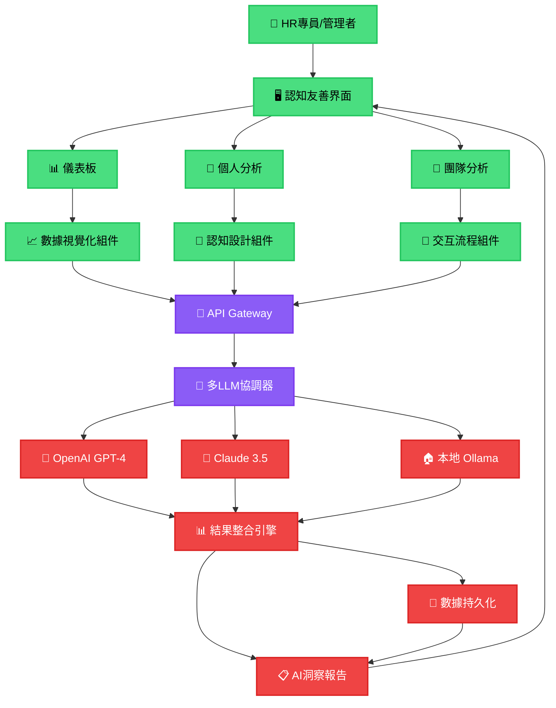

# 🎯 HR AI 平台項目狀態與架構分析

## 📊 原始設計目標回顧

基於 commit 歷史，我們最初設計的是一個 **5+1 多代理 AI 人才生態系統**：

### 🧠 **原始多代理架構** (已簡化)
```
原始設計 (過度複雜):
├── Master Orchestrator (主協調器)
├── Brain Agent (智能分析)
├── Culture Agent (文化分析)
├── Future Agent (未來預測)
├── Process Agent (流程優化)
└── HR Strategy Agent (策略制定)
```

**設計問題**: 架構過度複雜，導致"疊床架屋"現象

### 🎯 **簡化後的統一架構** (當前方向)
```
簡化設計:
├── 前端認知界面 (Vue.js 3)
├── 統一AI服務層 (多LLM整合)
└── 數據分析引擎 (智能洞察)
```

## 🗺️ **項目架構可視化流程圖**



## 📋 **詳細完成度分析**

### ✅ **已完成部分 (30%)**

#### 🎨 **前端認知界面系統** 
- **完成度**: 95%
- **功能範圍**:
  ```
  ├── 📊 Dashboard.vue (儀表板)
  │   ├── ✅ 統計卡片展示
  │   ├── ✅ 趨勢圖表框架
  │   ├── ✅ 近期活動列表
  │   └── ✅ AI建議展示區
  │
  ├── 👤 EmployeeAnalysis.vue (個人分析)
  │   ├── ✅ 員工選擇界面
  │   ├── ✅ 分析配置表單
  │   ├── ✅ 績效指標展示
  │   └── ✅ AI洞察模板
  │
  └── 👥 TeamAnalysis.vue (團隊分析)
      ├── ✅ 團隊選擇界面
      ├── ✅ 協作網絡框架
      ├── ✅ 成員表現表格
      └── ✅ 優化建議區域
  ```

#### 🧠 **認知設計系統**
- **完成度**: 100%
- **核心特色**:
  ```
  ├── ✅ Miller's Law 合規 (7±2限制)
  ├── ✅ 認知負荷監控
  ├── ✅ 注意力管理系統
  ├── ✅ 無障礙功能 (WCAG 2.1)
  ├── ✅ 減少動畫偏好
  └── ✅ 雙語國際化支援
  ```

#### 🛠️ **技術基礎建設**
- **完成度**: 90%
- **技術棧**:
  ```
  ├── ✅ Vue.js 3 + Composition API
  ├── ✅ TypeScript 嚴格模式
  ├── ✅ Pinia 狀態管理
  ├── ✅ Vue Router 路由系統
  ├── ✅ Vitest 測試框架
  ├── ✅ Tailwind CSS 設計系統
  └── ⚠️ 依賴安裝問題 (網路相關)
  ```

### 🔄 **規劃中部分 (0%)**

#### 🔌 **API Gateway 層**
- **完成度**: 0%
- **需要實現**:
  ```
  ├── ❌ RESTful API 設計
  ├── ❌ 身份驗證系統
  ├── ❌ 請求限制與監控
  ├── ❌ 錯誤處理機制
  └── ❌ API 文檔生成
  ```

#### 🤖 **AI 服務整合層**
- **完成度**: 0%
- **需要實現**:
  ```
  ├── ❌ 多LLM協調器設計
  ├── ❌ OpenAI GPT-4 整合
  ├── ❌ Claude API 整合
  ├── ❌ 本地 Ollama 部署
  ├── ❌ 結果整合演算法
  └── ❌ 成本優化策略
  ```

### ❌ **未開始部分 (70%)**

#### 💾 **數據處理引擎**
- **完成度**: 0%
- **核心需求**:
  ```
  ├── ❌ 員工數據模型設計
  ├── ❌ 績效分析算法
  ├── ❌ 機器學習模型訓練
  ├── ❌ 預測分析系統
  ├── ❌ 數據持久化方案
  └── ❌ 實時分析能力
  ```

#### 📊 **真實數據視覺化**
- **完成度**: 5% (僅框架)
- **需要整合**:
  ```
  ├── ❌ Chart.js 實際圖表
  ├── ❌ D3.js 網絡圖表
  ├── ❌ 實時數據更新
  ├── ❌ 互動式圖表
  └── ❌ 數據匯出功能
  ```

## 🎯 **具體可產出的東西 (當前)**

### 🎨 **立即可用產出**
1. **高品質UI/UX原型**
   - 完整的用戶介面展示
   - 認知友善設計驗證
   - 用戶體驗流程測試

2. **技術架構基礎**
   - Vue.js 3 應用框架
   - 組件化設計系統
   - 測試驅動開發環境

3. **設計規範文檔**
   - 認知設計原則實現
   - 無障礙功能規範
   - 國際化最佳實踐

### 📋 **可用於展示的功能**
```
模擬數據驅動的演示:
├── 📊 5個統計指標的動態展示
├── 👤 5名員工的完整分析報告
├── 👥 5個團隊的協作分析
├── 🧠 AI建議與洞察模板
└── 🎨 完整的用戶操作流程
```

## 🛣️ **距離真正AI Agent的差距分析**

### 📏 **完成度評估**
```
總體進度: ████████░░ 30%

前端界面: ████████████ 95% ✅
後端API:  ░░░░░░░░░░░░ 0%  ❌
AI整合:   ░░░░░░░░░░░░ 0%  ❌
數據引擎: ░░░░░░░░░░░░ 0%  ❌
```

### 🎯 **要成為真正AI Agent還需要**

#### 🔧 **技術開發 (預估 4-6 個月)**
1. **後端API開發** (2個月)
   ```python
   # 需要建立的核心服務
   ├── FastAPI 或 Django REST Framework
   ├── PostgreSQL 或 MongoDB 數據庫
   ├── Redis 快取系統
   ├── Celery 異步任務處理
   └── Docker 容器化部署
   ```

2. **AI服務整合** (2個月)
   ```python
   # AI功能實現
   ├── OpenAI API 整合與優化
   ├── Claude API 整合與備援
   ├── 本地 Ollama LLM 部署
   ├── 多模型協調與決策邏輯
   └── 成本控制與監控系統
   ```

3. **數據分析引擎** (2個月)
   ```python
   # 核心分析能力
   ├── 員工績效分析算法
   ├── 團隊協作模式識別
   ├── 技能匹配與推薦系統
   ├── 預測模型訓練與優化
   └── 實時分析與告警系統
   ```

#### 💰 **資源需求估算**
```
開發成本:
├── 👨‍💻 後端工程師: $60,000 (4個月)
├── 🤖 AI工程師: $80,000 (4個月)  
├── ☁️ 雲端基礎建設: $2,000/月
├── 🔑 AI API 費用: $1,000-5,000/月
└── 📊 總預算: $150,000-200,000
```

#### ⏰ **開發時間線**
```
Phase 1 (Month 1-2): 後端API開發
├── Week 1-2: 數據庫設計與API架構
├── Week 3-4: 核心API端點實現
├── Week 5-6: 身份驗證與權限系統
└── Week 7-8: API測試與優化

Phase 2 (Month 3-4): AI服務整合
├── Week 9-10: OpenAI API 整合
├── Week 11-12: Claude API 整合
├── Week 13-14: 多LLM協調系統
└── Week 15-16: AI成本優化

Phase 3 (Month 5-6): 數據引擎與部署
├── Week 17-18: 分析算法實現
├── Week 19-20: 預測模型訓練
├── Week 21-22: 系統整合測試
└── Week 23-24: 生產環境部署
```

## 🎯 **當前階段總結**

### 🏗️ **我們在哪裡**
- **階段**: 高品質原型完成階段
- **完成度**: 30% (主要是前端界面)
- **可用性**: 演示和概念驗證
- **商業價值**: 展示潛力，但無實際功能

### 🚀 **距離目標還有多遠**
- **技術差距**: 70% 的核心功能待開發
- **時間估算**: 4-6 個月全職開發
- **資源需求**: $150K-200K 預算
- **團隊需求**: 2-3 名專業工程師

### 💡 **當前最大價值**
1. **概念驗證成功** - 證明認知友善AI界面可行
2. **技術基礎完整** - 為真實AI開發提供堅實框架
3. **用戶體驗優秀** - 解決了HR工具普遍存在的可用性問題
4. **架構設計合理** - 避免了最初的過度複雜化問題

這個項目目前是一個**非常成功的原型**，為下一階段的真實AI功能開發奠定了優秀的基礎。